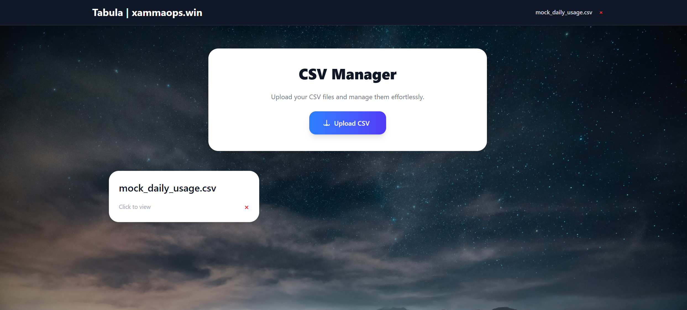
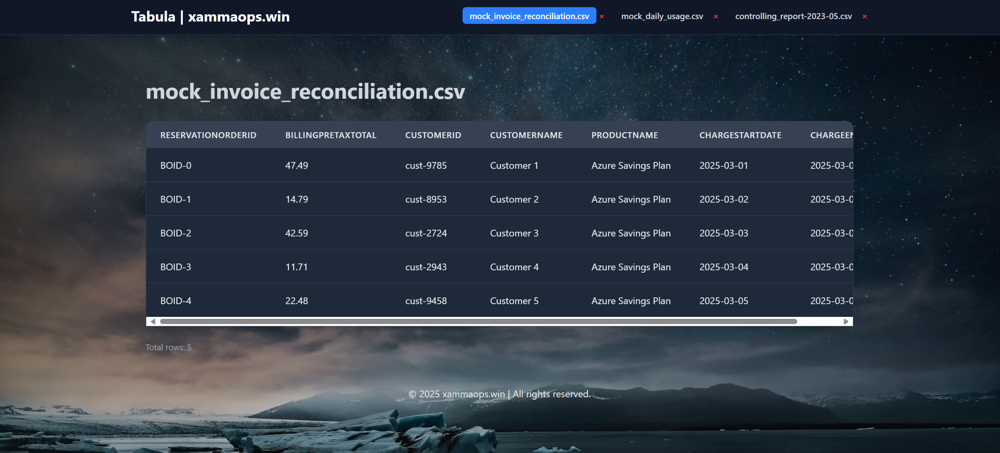

# Tabula - a beatiful CSV viewer webapp
Tabula is a web-based CSV viewer, that lets you render your CSV files as webpage.  
You can switch between your CSVs in the header as you wish.  

## Usage
### Use the upload button for the CSV you want to view

### Enjoy a view on your data directly rendered in your browser
