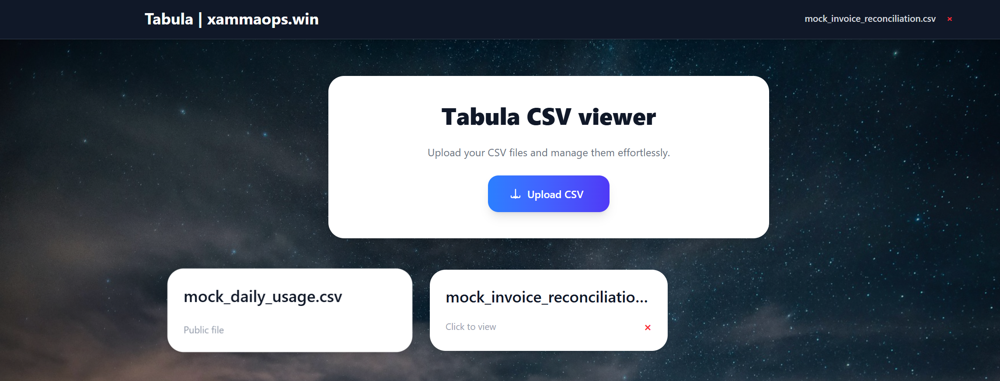

# Tabula - a beatiful CSV viewer webapp
Tabula is a web-based CSV viewer, that lets you render your CSV files as webpage.  
You can switch between your CSVs in the header as you wish.  

## Usage
### Use the upload button for the CSV you want to view


### Enjoy a view on your data directly rendered in your browser


### You can also put CSVfiles under /public/csv to render them on server



### Add CSV files via a configmap (K8s)
Use the helm values to create the configmap:
```yaml
csv:
  enabled: true
  pvcName: tabula-csv-pvc
  mountPath: /app/public/csv
  defaults:
    - name: sample.csv
      content: |
        col1,col2
        a,b
    - name: example.csv
      content: |
        foo,bar
        123,456
```